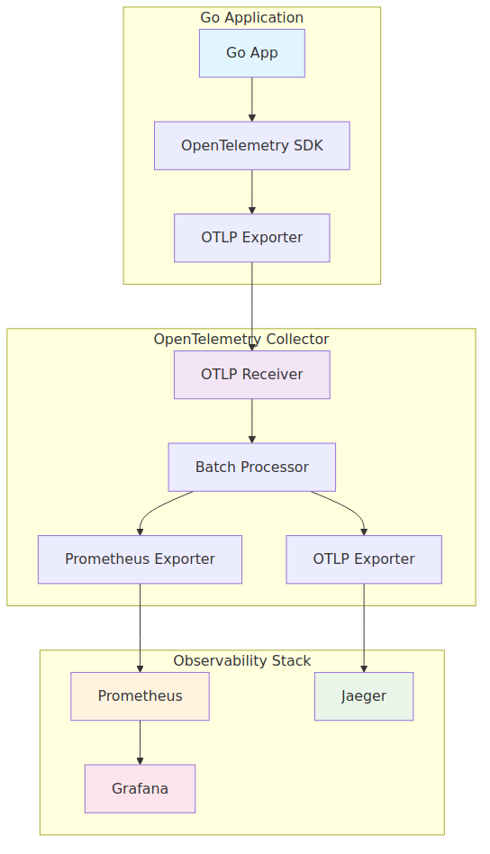

# OpenTelemetry + Go + Prometheus Sample Configuration

This project demonstrates a sample configuration using OpenTelemetry, Go, and Prometheus for observability and monitoring.

## Architecture



*Note: The diagram source is available in `architecture.mmd`. To regenerate the image, run `./generate-diagram.sh` (requires mermaid-cli).*

## Components

- **Go Application**: Generates metrics and traces using OpenTelemetry
- **OpenTelemetry Collector**: Collects and forwards metrics and traces
- **Prometheus**: Collects and stores metrics
- **Jaeger**: Visualizes traces
- **Grafana**: Displays metrics and traces in dashboards

## Quick Start

### 1. Install Dependencies

```bash
# Download Go application dependencies
cd app
go mod tidy
cd ..
```

### 2. Start with Docker Compose

```bash
docker compose up -d
```

### 3. Access Services

- **Go Application**: http://localhost:8080
  - `/`: Hello endpoint
  - `/metrics`: Metrics endpoint

- **Prometheus**: http://localhost:9090
  - View and query metrics

- **Jaeger**: http://localhost:16686
  - Visualize traces

- **Grafana**: http://localhost:3000
  - Username: `admin`
  - Password: `admin`
  - View metrics in dashboards

## Usage

### 1. Test the Application

```bash
# Access Hello endpoint
curl http://localhost:8080/

# Access metrics endpoint
curl http://localhost:8080/metrics
```

### 2. View Metrics

1. Access Prometheus (http://localhost:9090)
2. Execute the following queries to view metrics:
   - `http_requests_total`: HTTP request count
   - `custom_operations_total`: Custom operation count
   - `request_duration_seconds`: Request duration

### 3. View Traces

1. Access Jaeger (http://localhost:16686)
2. Select service name `go-sample-app`
3. Search and view traces

### 4. Grafana Dashboard

1. Access Grafana (http://localhost:3000)
2. Login (admin/admin)
3. View metrics in the automatically created dashboard

## Stop Services

```bash
docker compose down
```

## File Structure

```
.
├── docker-compose.yml              # Docker Compose configuration
├── otel-collector-config.yaml     # OpenTelemetry Collector configuration
├── prometheus.yml                  # Prometheus configuration
├── architecture.mmd                # Mermaid diagram source
├── generate-diagram.sh             # Diagram generation script
├── app/
│   ├── main.go                    # Go application
│   ├── go.mod                     # Go dependencies
│   └── Dockerfile                 # Go application Dockerfile
└── grafana/
    └── provisioning/
        ├── datasources/
        │   └── prometheus.yml     # Grafana datasource configuration
        └── dashboards/
            ├── dashboard.yml       # Grafana dashboard configuration
            └── go-app-dashboard.json # Dashboard definition
```

## Customization

### Adding Metrics

You can add new metrics in `app/main.go`:

```go
// Add counter
counter, _ := meter.Int64Counter("my_counter")
counter.Add(ctx, 1)

// Add histogram
histogram, _ := meter.Float64Histogram("my_histogram")
histogram.Record(ctx, value)
```

### Adding Traces

```go
ctx, span := tracer.Start(ctx, "operation_name")
defer span.End()
```

## Troubleshooting

### Application Won't Start

1. Check if dependencies are properly installed:
   ```bash
   cd app
   go mod tidy
   ```

2. Force rebuild Docker images:
   ```bash
   docker compose build --no-cache
   ```

### Metrics Not Displaying

1. Check OpenTelemetry Collector logs:
   ```bash
   docker compose logs otel-collector
   ```

2. Verify Prometheus targets are properly registered:
   http://localhost:9090/targets

### Traces Not Appearing in Jaeger

1. Check if the service name is correct in Jaeger UI
2. Verify OpenTelemetry Collector configuration
3. Check application logs for connection errors

## Configuration Details

### OpenTelemetry Collector

The collector is configured to:
- Receive OTLP data on ports 4317 (gRPC) and 4318 (HTTP)
- Export metrics to Prometheus
- Export traces to Jaeger via OTLP

### Prometheus

Configured to scrape:
- OpenTelemetry Collector metrics endpoint
- Go application metrics endpoint

### Jaeger

Configured with OTLP support enabled to receive traces from the OpenTelemetry Collector.

### Grafana

Pre-configured with:
- Prometheus datasource
- Sample dashboard for Go application metrics

## Metrics and Traces

### Generated Metrics

- `http_requests_total`: Counter for HTTP requests
- `custom_operations_total`: Counter for custom operations
- `request_duration_seconds`: Histogram for request duration

### Generated Traces

- `handleHello`: Trace for the main endpoint
- `handleMetrics`: Trace for the metrics endpoint

## Development

### Local Development

1. Start the infrastructure:
   ```bash
   docker compose up -d prometheus jaeger grafana otel-collector
   ```

2. Run the Go application locally:
   ```bash
   cd app
   go run main.go
   ```

### Adding New Endpoints

1. Add new handlers in `app/main.go`
2. Include tracing and metrics instrumentation
3. Rebuild and restart the application

## Contributing

1. Fork the repository
2. Create a feature branch
3. Make your changes
4. Test the configuration
5. Submit a pull request

## License

This project is open source and available under the MIT License.

## Diagram Generation

The architecture diagram is generated from the Mermaid file `architecture.mmd`. To regenerate the diagram:

1. Install mermaid-cli:
   ```bash
   npm install -g @mermaid-js/mermaid-cli
   ```

2. Generate the diagram:
   ```bash
   ./generate-diagram.sh
   ```

Alternatively, you can use the online Mermaid editor at https://mermaid.live/ to edit the diagram. 